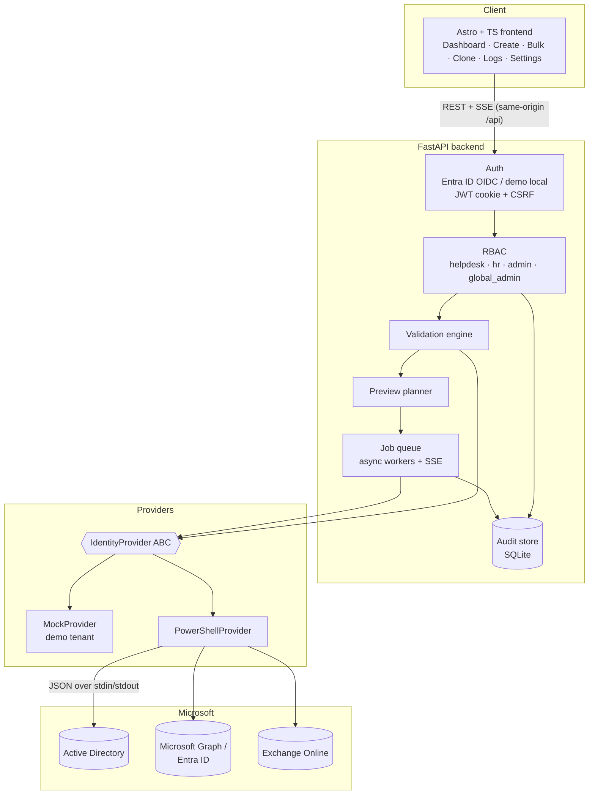
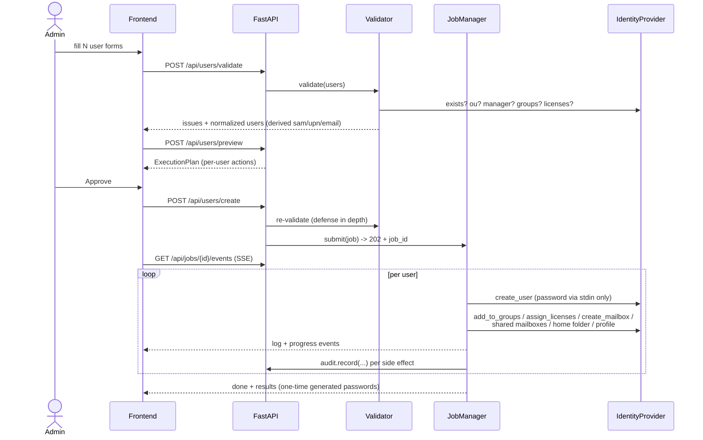

# Architecture

## Overview

Three tiers with one hard seam (the identity provider interface):

## The provider seam (Dependency Inversion)

`app/services/provider.py` defines `IdentityProvider` — the only surface the
API layer, validator and job engine ever touch. Implementations:

| Implementation | Used when | Backing |
|---|---|---|
| `MockProvider` | `EIO_DEMO_MODE=true` | In-memory Northwind Dynamics tenant, persisted to `backend/data/demo_state.json`. Enforces the same failure modes (duplicates, unknown OUs, exhausted licenses). |
| `PowerShellProvider` | production | Spawns PowerShell 7 scripts; each method maps 1:1 to a script (see docs/POWERSHELL.md). |

This is what makes every feature testable without a domain controller, and
what future integrations (ServiceNow, Workday, Graph-native) plug into: a new
provider or a decorator around an existing one.

## Onboarding flow (sequence)

## Job engine

- `JobManager` keeps an `asyncio.Queue` consumed by N workers
  (`EIO_JOB_WORKERS`, default 2) — bulk batches never block the API.
- Per-user execution: account creation failure marks that user failed and the
  batch continues; failures in later steps (groups, licenses, mailbox, home
  folder, profile) degrade to per-user warnings — matching operational
  reality where a license pool may be empty but the account must still exist.
- Subscribers get events over SSE: `snapshot`, `log`, `progress`, `done`
  (+ `ping` keep-alives). Jobs are retained in memory (last 200); every side
  effect is durably audited in SQLite.

## Validation & identity derivation

`app/services/validation.py` normalizes then checks each batch:

1. Derivation: `display_name = First Last`; `sam = first.last` (accent-folded,
   ASCII, ≤20 chars) with numeric suffix on collision (warning);
   `upn/email = sam@upn-suffix`.
2. Checks: required fields, naming-convention regex, batch duplicates,
   directory duplicates (sam/UPN/email incl. proxy addresses), OU existence,
   manager resolution, group existence, license SKU validity + pool
   availability across the batch, manual-password policy compliance,
   expiration in future, duplicate employee ID (warning).

Issues carry `{index, field, code, severity}` so the UI anchors them to the
exact form and field.

## Security model

| Concern | Mechanism |
|---|---|
| Authentication | Entra ID OIDC auth-code flow (MSAL, app roles → platform roles). Demo mode: local accounts, PBKDF2-HMAC-SHA256 (210k iters). |
| Session | Short-lived JWT in httpOnly SameSite=Lax cookie; sliding renewal on `/me`; `EIO_SESSION_TIMEOUT_MINUTES`. |
| CSRF | Double-submit cookie (`eio_csrf` + `X-CSRF-Token`) enforced by middleware on every mutating `/api` call. |
| RBAC | Explicit permission matrix (`core/rbac.py`); every route declares its permission; denials are audited. |
| Brute force | Per-username+IP lockout (5 attempts / 15 min). |
| Secrets | Passwords travel request-body → job → PowerShell **stdin** (never argv, never logs, never storage). Generated passwords shown once in job results only. Entra client secret via env/vault. |
| Transport | HTTPS termination at ingress; HSTS emitted when `EIO_COOKIE_SECURE=true`; `X-Content-Type-Options`, `X-Frame-Options`, `Referrer-Policy` headers. |
| Audit | SQLite trail: ts, actor, role, action, target, status, computer, source IP, JSON details. Export CSV/JSON/PDF (export itself is audited). |

## Logging

Structured JSONL everywhere: backend (`logs/backend.jsonl`, rotating) and
PowerShell (`logs/powershell.jsonl` + `logs/audit-ps.jsonl`, mutex-guarded) —
directly ingestible by Sentinel/Splunk/ELK.

## Extensibility (future integrations)

The design anticipates the roadmap items without implementing them:

- **HR sources (Workday, SAP HR, ServiceNow, Jira)**: implement an importer
  (`services/importer.py` already normalizes arbitrary HR headers) or a
  webhook route that feeds `CreateUsersRequest` — everything downstream
  (validation → preview → jobs → audit) is reused.
- **Graph-native operations (MFA, Conditional Access, Intune, BitLocker)**:
  new methods on `IdentityProvider` + new scripts; the job engine's step
  pattern (log → execute → audit → degrade-to-warning) extends per step.
- **Notifications (Teams, Slack, email)**: subscribe to job completion in
  `JobManager._run` — the event stream already carries everything needed.
- **Azure Automation / hybrid runbooks**: `PowerShellRunner` is the single
  chokepoint to swap local `pwsh` for a runbook/WinRM/SSH executor.
